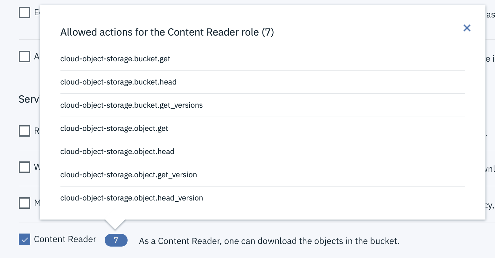

---

copyright:
  years: 2017, 2024
lastupdated: "2024-04-16"

keywords: access control, iam, basics, buckets

subcollection: cloud-object-storage

---

{{site.data.keyword.attribute-definition-list}}

# Assigning access to an individual bucket
{: #iam-bucket-permissions}

Assign access roles for users and Service IDs against buckets, by using either the UI or the CLI to create policies.
{: shortdesc}

| Access role    | Example actions                                              |
|:---------------|--------------------------------------------------------------|
| Manager        | Make objects public, create, and destroy buckets and objects |
| Writer         | Create and destroy buckets and objects                       |
| Reader         | List buckets, list objects, and download objects.            |
| Content Reader | List and download objects                                    |
| Object Reader  | Download objects                                             |
| Object Writer  | Upload objects                                               |
{: caption="Buckets" caption-side="top"}

## Granting access to a user
{: #iam-user-access}

If the user needs to be able to use the console and is able to see the list of all buckets within an instance, it is possible to use a custom platform access role. This allows them to view only the contents of specific buckets. If it is not appropriate for a user to read the names of other buckets then it is necessary to design and implement a custom portal or other user interface using the API.

If the user interacts with data by using the API and doesn't require console access, _and_ they are a member of your account, you can grant access to a single bucket without any access to the parent instance using the default roles.

## Policy enforcement
{: #iam-policy-enforcement}

IAM policies are enforced hierarchically from greatest level of access to most restricted. Conflicts are resolved to the more permissive policy. For example, if a user has both the `Writer` and `Reader` service access role on a bucket, the policy granting the `Reader` role is ignored.

This is also applicable to service instance and bucket level policies.

- If a user has a policy granting the `Writer` role on a service instance and the `Reader` role on a single bucket, the bucket-level policy is ignored.
- If a user has a policy granting the `Reader` role on a service instance and the `Writer` role on a single bucket, both policies are enforced and the more permissive `Writer` role will take precedence for the individual bucket.

If it is necessary to restrict access to a single bucket (or set of buckets), ensure that the user or Service ID doesn't have any other instance level policies by using either the console or CLI.

See [Best practices for organizing resources and assigning access](/docs/account?topic=account-account_setup) to learn more.

### Create a new policy for a user
{: #iam-policy-enforcement-console}
{: ui}

To create a new bucket-level policy:

1. Navigate to the **Access IAM** console from the **Manage** menu.
2. Select **Users** from the left navigation menu.
3. Select a user.
4. Select the **Access Policies** tab to view the user's existing policies, assign a new policy, or edit an existing policy.
5. Click **Assign access** to create a new policy.
6. Choose **Assign access to resources**.
7. First, select **Cloud Object Storage** from the services menu.
8. Then, select the appropriate service instance. Enter `bucket` in the **Resource type** field and the bucket name in the **Resource ID** field.
9. Select the wanted service access role. Selecting the lozenge with the number of actions show the actions available to the role, as exemplified for "Content Reader" in Figure 1.
10. Click **Assign**

{: caption="Example actions per Content Reader role"}

Note that leaving the **Resource Type** or **Resource** fields blank will create an instance-level policy.
{: tip}

### Create a new policy for a user CLI command
{: #iam-policy-enforcement-cli}
{: cli}

From a terminal run the following command:

```sh
ibmcloud iam user-policy-create <user-name> \
      --roles <role> \
      --service-name cloud-object-storage \
      --service-instance <resource-instance-id> \
      --resource-type bucket \
      --resource <bucket-name>
```
{: codeblock}

To list existing policies:

```sh
ibmcloud iam user-policies <user-name>
```
{: codeblock}

To edit an existing policy:

```sh
ibmcloud iam user-policy-update <user-name> <policy-id> \
      --roles <role> \
      --service-name cloud-object-storage \
      --service-instance <resource-instance-id> \
      --resource-type bucket \
      --resource <bucket-name>
```
{: codeblock}

## Granting access to a Service ID
{: #iam-service-id}

If you need to grant access to a bucket for an application or other non-human entity, use a Service ID. The Service ID can be created specifically for this purpose, or can be an existing Service ID already in use.

### Create a new policy for a user
{: #iam-service-id-console}
{: ui}

1. Navigate to the **Access (IAM)** console from the **Manage** menu.
2. Select **Service IDs** from the left navigation menu.
3. Select a Service ID to view any existing policies, and assign a new policy or edit an existing policy.
4. Select the service instance, service ID, and desired role.
5. Enter `bucket` in the **Resource Type** field and the bucket name in the **Resource** field.
6. Click **Submit**

Note that leaving the **Resource Type** or **Resource** fields blank will create an instance-level policy.
{: tip}

### Create a new policy for a Service ID
{: #iam-service-id-cli}
{: cli}

From a terminal run the following command:

```sh
ibmcloud iam service-policy-create <service-id-name> \
      --roles <role> \
      --service-name cloud-object-storage \
      --service-instance <resource-instance-id> \
      --resource-type bucket \
      --resource <bucket-name>
```
{: codeblock}

To list existing policies:

```sh
ibmcloud iam service-policies <service-id-name>
```
{: codeblock}

To edit an existing policy:

```sh
ibmcloud iam service-policy-update <service-id-name> <policy-id> \
      --roles <role> \
      --service-name cloud-object-storage \
      --service-instance <resource-instance-id>
      --resource-type bucket \
      --resource <bucket-name>
```
{: codeblock}
